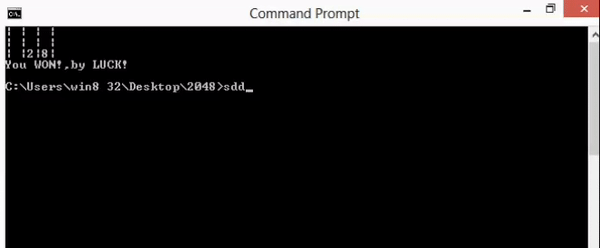

# Game 2048

2048 is a single-player sliding block puzzle game.
The object of the game is to combine the numbers displayed on the tiles until you reach 2048.To run this you will need python

# Description

When you start the game, there will be two “tiles” on the grid, each displaying the number 2. You hit the (w,a,s and d) keys on your keyboard to move the tiles around — and also to generate new tiles, which will also be valued at 2. When two equal tiles collide, they combine to give you one greater tile that displays their sum. The more you do this, obviously, the higher the tiles get and the more crowded the board becomes. Your objective is to reach 2048 or winning tile you entered before the board fills up.

## Installation

Use the PyPI package pip to install argparse.

```bash
pip install argparse
```

Use the PyPI package pip to install pynput.

```bash
pip install pynput
```

## Usage

Navigate to where you saved the python file in your command prompt(Windows 7). Now just run 'python 2048.py' and then write --n (To change the playable grid size press a number from 3 to 7 on your keyboard and it will set the grid to nxn where n is the number you pressed.
) and --w (the winning tile).Then launch the application.

## Info
We have run this game in command promt of windows 7.

If you are using linux terminal replace

```bash
os.system('cls')
```
with

```bash
os.system('clear')
```

## Playing the Game
Standard 2048 rules apply.

Pressing the 'w' key on your keyboard will move the number in upward direction.

Pressing the 's' key on your keyboard will move the number in downward direction.

Pressing the 'a' key on your keyboard will move the number in left direction.

Pressing the 'd' key on your keyboard will move the number in right direction.


## Result 




